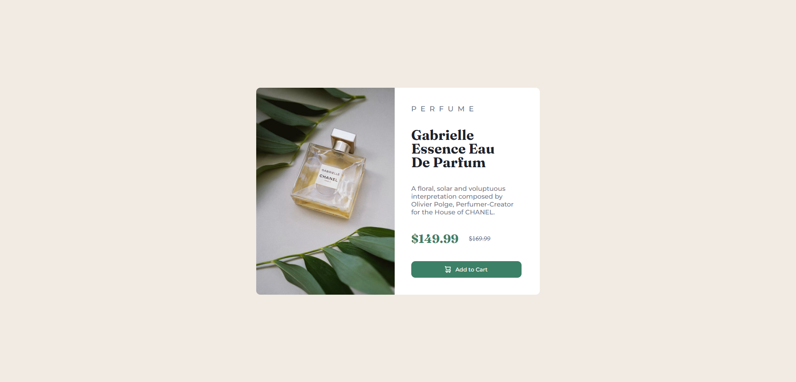
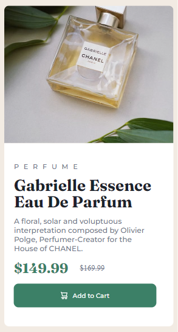

# Frontend Mentor - Product preview card component solution

This is a solution to the [Product preview card component challenge on Frontend Mentor](https://www.frontendmentor.io/challenges/product-preview-card-component-GO7UmttRfa). Frontend Mentor challenges help you improve your coding skills by building realistic projects. 

## Table of contents

- [Overview](#overview)
  - [The challenge](#the-challenge)
  - [Screenshot](#screenshot)
  - [Links](#links)
- [My process](#my-process)
  - [Built with](#built-with)
  - [What I learned](#what-i-learned)
  - [Continued development](#continued-development)
- [Author](#author)


## Overview

### The challenge

Users should be able to:

- View the optimal layout depending on their device's screen size
- See hover and focus states for interactive elements

### Screenshot
- Desktop view


- Mobile view


- 


### Links

- Solution URL: [GitHub](https://github.com/EshrakRahman/Frontend-Mentor---Product-preview-card-component)
- Live Site URL: [GitHub Page](https://eshrakrahman.github.io/Frontend-Mentor---Product-preview-card-component/)

## My process

### Built with

- Semantic HTML5 markup
- CSS custom properties
- Flexbox
- Desktop-first workflow


### What I learned

I recently completed a newbie challenge on FrontendMasters, diving deep into the world of CSS Flexbox. Before this, positioning items in dynamic layouts felt complex. Flexbox, however, transformed my approach, offering a streamlined method to align and distribute elements within a container. Through properties like justify-content, align-items, and flex-direction, I mastered the art of creating responsive and visually appealing designs. This wasn't just about grasping a theoretical concept; it was hands-on learning, giving me the confidence to tackle modern web design challenges with a fresh perspective.

To see how you can add code snippets, see below:

```html
<p class="ctg">
  Perfume
</p>
<p class="tittle">
  Gabrielle Essence Eau De Parfum
</p>
<p class="description">
  A floral, solar and voluptuous interpretation composed by Olivier Polge,
  Perfumer-Creator for the House of CHANEL.
</p>
```
```css
.product-info {
  width: 50%;
  display: flex;
  flex-direction: column;
  justify-content: space-between;
  align-items: flex-start;
  height: 100%;
  background-color: hsl(0, 0%, 100%) ;
  padding: 40px 30px 40px 40px;
  border-top-right-radius: 10px;
  border-bottom-right-radius: 10px;
}
```

### Continued development

Having tackled FrontendMasters' challenge, I delved into CSS Flexbox, streamlining complex layouts with newfound mastery. Using pivotal properties, I now confidently craft responsive designs, a testament to my hands-on growth in modern web design. My continuous development highlights my resilience and adaptabilit

## Author

- Website - [eshrakrahman](https://github.com/EshrakRahman)
- Frontend Mentor - [@eshrakrahman](https://www.frontendmentor.io/profile/eshrakrahman)


